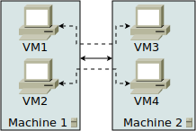

.. _quickstart:

============
Quick-Start
============

Let's use LSDN to configure a simple network: four VMs, running on two physical
machines. We will call the physical machines A and B and the virtual machines 1,
2, 3 and 4. The machines 1 and 2 are running on physical machine A, machines 2
and 3 are located on physical machine B.

    Network setup. Solid lines are physical machine connections, dashed lines
    denotes communication between virtual machines.

VMs 1 and 3 can communicate with each other and so can VMs 2 and 3. This means we
will create two virtual networks, one for VM 2 and second for VM 3.

Using configuration files
-------------------------

First, create the file ``config.lsctl`` with the following contents:

.. code-block:: tcl

    # Boilerplate
    namespace import lsdn::*
    # Choose the network tunneling technology
    settings vlan

    # Define the two virtual networks we have mentioned
    net 1
    net 2

    # Describe the network
    phys -name A -if eth0 -ip 192.168.0.1 {
        virt -name 1 -if tap0 -mac 14:9B:DD:6B:81:71 -net 1
        virt -name 2 -if tap1 -mac 7D:42:B4:0F:EC:9A -net 2
    }

    phys -name A -if eth0 -ip 192.168.0.2 {
        virt -name 3 -if tap0 -mac 14:9B:DD:6B:81:71 -net 1
        virt -name 4 -if tap1 -mac 7D:42:B4:0F:EC:9A -net 2
    }

    # Tell LSDN that we are running on phys given as first script argument
    claimLocal [lindex $argv 1]
    # Activate everything
    commit

